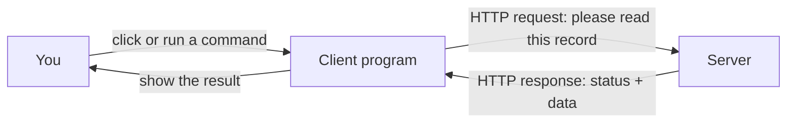
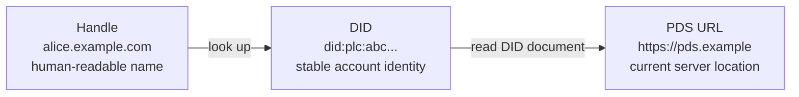
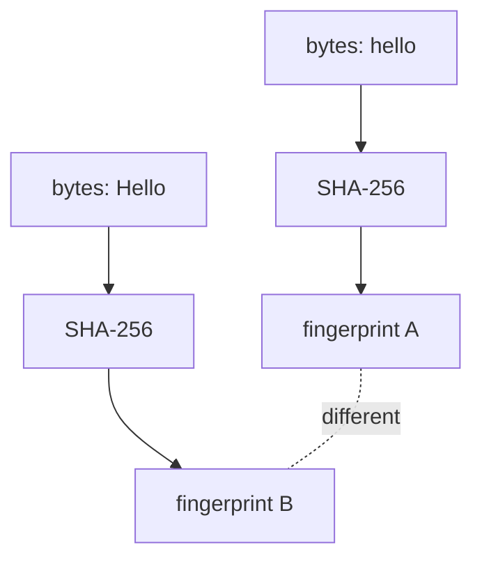
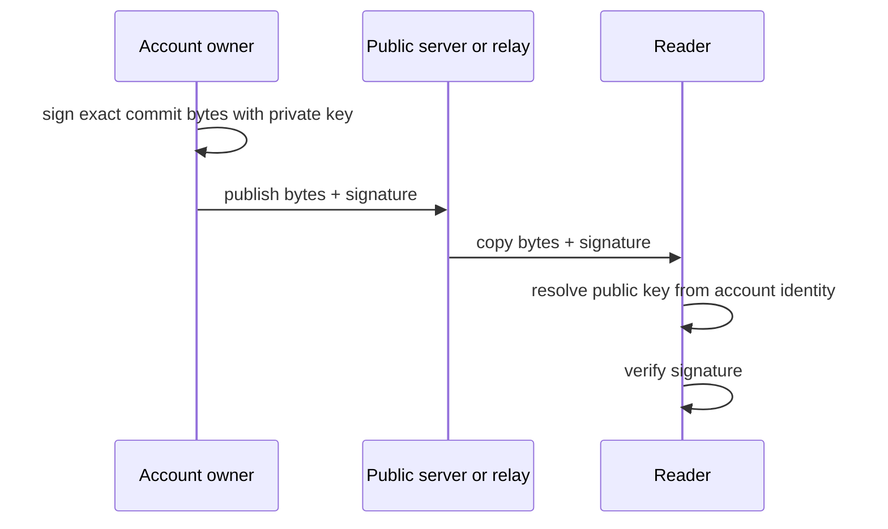
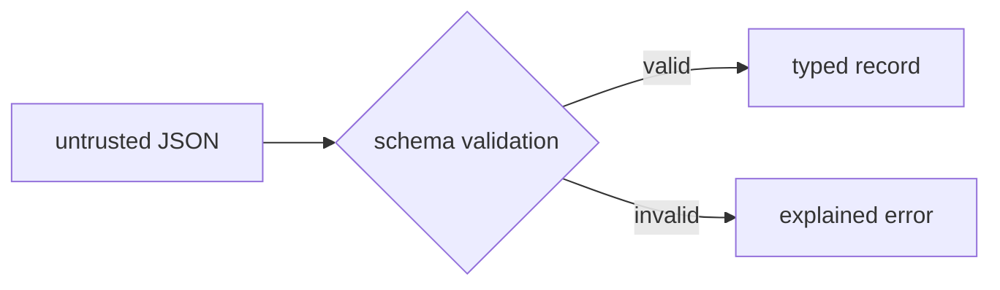

# Before chapter 01: the minimum background

## Who this page is for

Start here if terms such as server, DNS, public key, or content hash are not yet
comfortable. You do not need prior knowledge of Bluesky, decentralized systems,
cryptography, or Scala. This page supplies the small mental model used by the
rest of the guide.

The protocol-specific words—DID, PDS, CID, MST, Lexicon, and XRPC—are deliberately
left until the end. First we build them from ordinary ideas.

## 1. A client asks a server to do something

A client is a program acting for a user. A server is a program that waits for
requests. HTTP is the request/response language they use on the web.



An HTTP request contains a method, an address, and sometimes a body:

```text
GET  https://example.com/records/123       read something
POST https://example.com/records           create or change something
```

You do not need to know sockets, TCP, or TLS internals for this guide. You only
need to distinguish the address being contacted from the identity of the account
whose data is requested.

## 2. A name is not the same thing as an identity or a location

Consider a person who moves house:

```text
name:       Alice                   easy for people to remember
person:     the same Alice          should remain the same after moving
address:    1 Old Street            changes when Alice moves
```

AT Protocol makes the same separation:



The account can move to a different server without becoming a different account.
This is why later chapters refuse to use one string for all three concepts.

## 3. A hash is a fingerprint of bytes

A hash function turns any bytes into a fixed-size fingerprint. The same bytes
produce the same fingerprint. Changing even one byte should produce a different
fingerprint.



A hash can detect a change, but it does not identify who created the data. Anyone
can calculate a hash. AT Protocol puts the hash inside a CID, short for content
identifier.

## 4. A digital signature proves which key approved bytes

A key pair contains:

- a private key, which the owner keeps secret and uses to sign;
- a public key, which everyone may use to verify.



A signature is not encryption. The signed public data remains readable. The
signature lets a reader detect modification and verify that the matching private
key approved those exact bytes.

## 5. JSON is text-shaped data

Most web APIs exchange JSON. A JSON value is one of six shapes:

```json
{
  "text": "hello",
  "likes": 3,
  "published": true,
  "replyTo": null,
  "tags": ["scala", "atproto"]
}
```

The six shapes are object, array, string, number, boolean, and null. Chapter 04
implements a parser so you can see where untrusted text becomes typed data.

## 6. A schema describes allowed data

A schema is a machine-readable contract. It can say that `text` is required,
must be a string, and has a maximum length. Rejecting invalid data at the boundary
prevents every later layer from having to guess what the data means.



AT Protocol calls its schema language Lexicon. XRPC uses those schemas to describe
HTTP methods, and records use them to describe stored values.

## Translate the protocol vocabulary

The following table is enough to begin chapter 01. Return to the full
[glossary](glossary.md) whenever a term appears without a clear meaning.

| Protocol word | Start with this plain meaning |
| --- | --- |
| handle | an account name people can read |
| DID | the stable identity behind that name |
| DID document | the identity's current server address and public keys |
| PDS | the server that stores an account and accepts its writes |
| record | one typed value stored by an account |
| repository | all public records belonging to one account |
| CID | a fingerprint-based name for exact bytes |
| commit | a signed statement naming the current repository contents |
| Lexicon | a schema describing records or API calls |
| XRPC | the HTTP calling convention that uses Lexicon names |
| Relay | a service that copies updates from many account servers |
| AppView | a service that turns copied records into feeds, search, or threads |

## What you may ignore for now

You do not need to understand these before chapter 01:

- DAG-CBOR encoding details;
- Merkle Search Tree construction;
- OAuth, PKCE, PAR, or DPoP;
- WebSocket framing;
- Scala type-system terminology.

Each is introduced immediately before it is used. If a chapter relies on one of
them without explanation, that is a documentation bug.

## Readiness check

You are ready when you can answer these four questions:

1. Why can an account name, stable identity, and server address be different?
2. What can a hash detect, and what can it not prove?
3. Which key signs, and which key verifies?
4. What does a schema do to untrusted JSON?

Approximate answers are enough. Continue to
[chapter 01](01-mental-model.md) and refine them by running the code.
