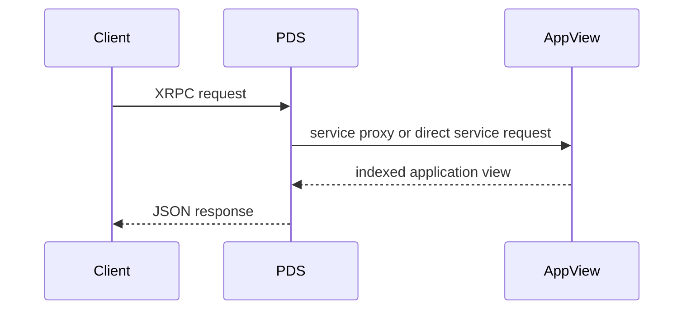
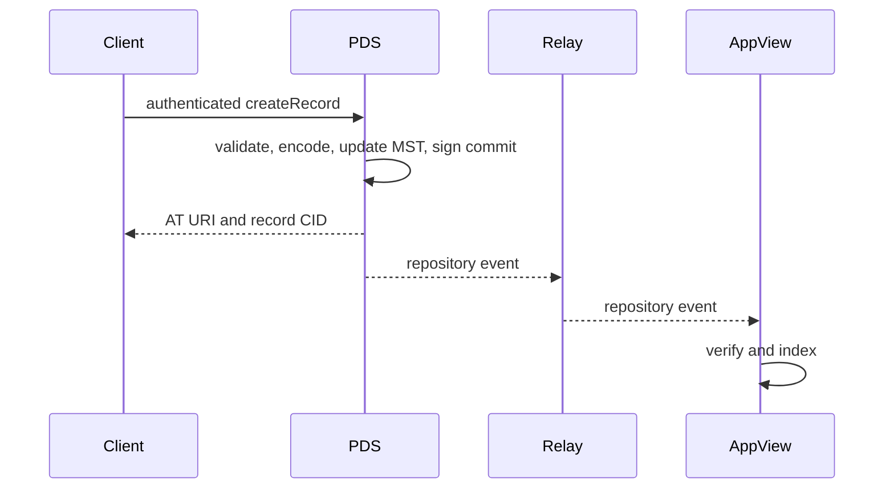

# 01: AT Protocol のメンタルモデル

## この章のゴール

AT Protocol を「Bluesky の API」ではなく、identity、署名されたデータ、hosting、配送、application view を分離する protocol として説明できるようにします。

## まず五つに分ける

### 1. Identity

account の永続的な識別子は DID です。handle は人間が読みやすく変更可能な名前です。

```text
handle: alice.example.com       人間向け。変更できる
DID:    did:plc:...             account の安定した識別子
```

AT Protocol が現在相互運用対象にしている DID method は `did:plc` と `did:web` です。DID document には少なくとも、現在の PDS の場所と repository commit を検証する公開鍵が現れます。

重要なのは `handle -> DID` の結果だけを信頼しないことです。DID document 側も同じ handle を宣言しているかを確認することで、古い DNS や乗っ取られた片方向の紐付けを検出します。

### 2. Repository

各 account は公開 record の key/value map を一つ持ちます。key は `collection/rkey`、value は DAG-CBOR record の CID です。

```text
app.bsky.actor.profile/self       -> bafy...
app.bsky.feed.post/3l...          -> bafy...
com.example.bookmark/3l...        -> bafy...
```

map は deterministic な Merkle Search Tree (MST) で表現されます。同じ key/value 集合なら挿入順に関係なく同じ root CID になります。commit は root CID を含み、account の署名鍵で署名されます。

これにより、データを PDS 以外から受け取っても内容、tree、commit signature を検証できます。「PDS が正しいと言ったから」ではなく、content address と署名で判断します。

### 3. PDS

Personal Data Server は account を host します。主な責務は次です。

- 認証された client request を受ける
- record write を検証し repository commit を作る
- blob を保存・配信する
- repository export と event stream を提供する
- identity と account lifecycle を管理する
- AppView など別 service への request を必要に応じて proxy する

PDS は application の検索結果や timeline をすべて持つ必要はありません。

### 4. Relay / Sync

PDS は repository update を event stream に流します。Relay は複数 PDS の stream を集約できます。consumer は最初に CAR 形式の repository export で backfill し、その後 stream で差分を追います。

stream に欠落を見つけたら、推測で埋めず full repository を取り直します。各 repository の revision は同期位置を判定する logical clock です。

### 5. AppView

AppView は repository record を index し、検索、thread、feed、集約済み profile のような application-specific view を返します。`app.bsky.*` は microblogging application の Lexicon であり、AT Protocol core そのものではありません。

同じ account repository に別 application の record を共存させられます。record の意味と API schema は Lexicon の NSID で名前空間化されます。

## 読み書きの流れ

### 読み取り



公開 repository record は PDS から直接読めます。一方、feed や検索のような集約結果は通常 AppView の責務です。

### 書き込み



client が AppView の database へ直接書くわけではありません。source of truth は account repository です。

## URI を混同しない

| 表現 | 例 | 意味 |
| --- | --- | --- |
| HTTPS URL | `https://pds.example/xrpc/...` | network 上の endpoint |
| DID | `did:plc:...` | 永続的な identity |
| handle | `alice.example.com` | 変更可能な人間向け名 |
| AT URI | `at://did:plc:.../app.bsky.feed.post/3l...` | repository 内の record |
| CID | `bafy...` | 特定の bytes の content address |
| NSID | `com.atproto.repo.getRecord` | schema / method の名前 |

AT URI は取得先の server を固定しません。DID を解決して現在の PDS を発見してから、HTTPS の XRPC endpoint を呼びます。この間接参照が hosting migration を可能にします。

## XRPC と Lexicon

XRPC は HTTP 上の共通規約です。

- query は `GET /xrpc/{NSID}`
- procedure は `POST /xrpc/{NSID}`
- query parameter、input、output、error は Lexicon schema で宣言される
- JSON が中心だが、blob、CAR、event stream の binary body も扱う

Lexicon は単なる JSON shape だけでなく、method 名と record type に共有された意味を与えます。知らない Lexicon record も repository block として転送でき、理解する service だけが index できます。

## 信頼境界を一文で言う

この教材では、処理ごとに次の三問を置きます。

1. 誰がこの値を主張したか。
2. 何を使って検証できるか。
3. いつ再検証しなければならないか。

たとえば record を受け取ったとき、JSON を返した host だけを信頼するのでは不十分です。record bytes の CID、MST への包含、commit signature、署名鍵を含む現在の DID document を順に検証します。一方、handle と account hosting status は repository の署名だけでは自己認証できないため、identity resolution が別途必要です。

## 手を動かす

まだコードは書きません。任意の Bluesky profile を一つ選び、紙かテキストに次を別々に書いてください。

1. handle
2. DID
3. PDS endpoint
4. profile record の AT URI
5. profile record の CID

五つを同じ「ID」と呼ばず、それぞれが変化する条件を説明できればこの章は完了です。

## 仕様への入口

- [Protocol overview](https://atproto.com/guides/overview)
- [AT Protocol specification](https://atproto.com/specs/atp)
- [DID](https://atproto.com/specs/did)
- [Repository](https://atproto.com/specs/repository)
- [XRPC](https://atproto.com/specs/xrpc)
- [Sync](https://atproto.com/specs/sync)

