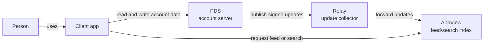
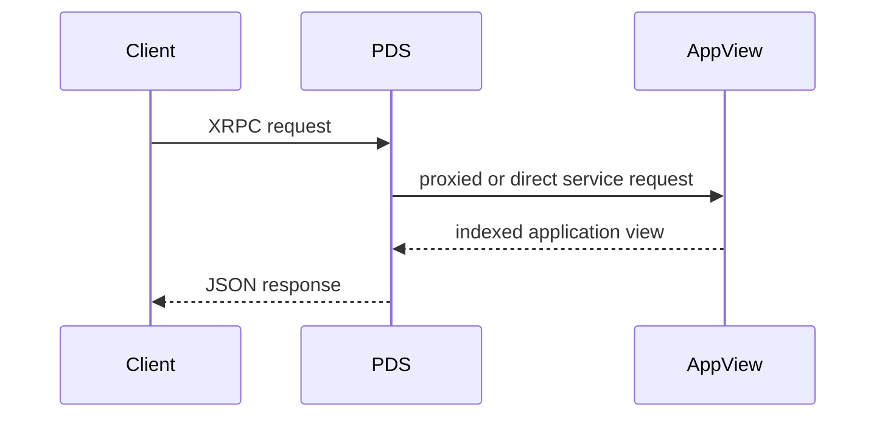
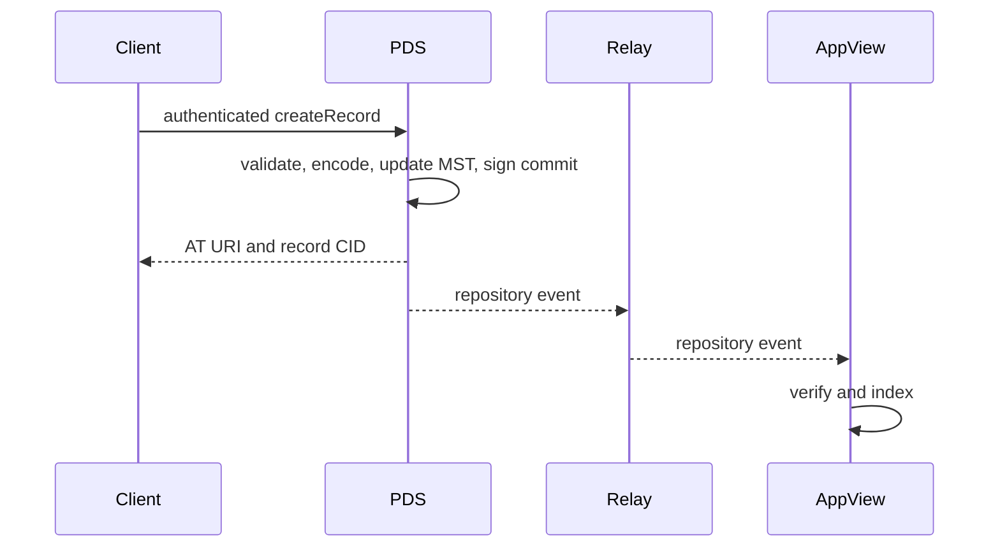

# 01: The AT Protocol mental model

## Goal

Explain AT Protocol as a separation of identity, signed data, hosting,
distribution, and application views—not merely as “the Bluesky API.”

## Prerequisites and new words

This chapter assumes only the client/server and identity ideas from
[the prerequisite chapter](00-prerequisites.md). It introduces five actors:

- PDS: stores an account's records and accepts writes;
- Relay: copies updates from many PDS instances;
- AppView: builds feeds, search, and threads from copied records;
- repository: one account's public record collection;
- commit: a signed checkpoint of that collection.

You do not need to understand CID, DAG-CBOR, MST, or XRPC internals yet. In this
chapter they are labels on boxes; later chapters open those boxes.

## The whole system in one picture



For a first reading, remember only this: the PDS owns account storage; the Relay
copies changes; the AppView makes application-specific views. They may be run by
different organizations.

## Five distinct parts

### 1. Identity

An account's durable identifier is a DID. A handle is a human-readable,
changeable name.

```text
handle: alice.example.com       human-facing; may change
DID:    did:plc:...             stable account identifier
```

The interoperable DID methods are currently `did:plc` and `did:web`. A DID
document identifies at least the current PDS and a public key used to verify
repository commits.

Never trust only `handle -> DID`. Verify that the DID document also claims the
same handle. This detects stale DNS and malicious one-way bindings.

### 2. Repository

Each account has one public record key/value map. A key is
`collection/rkey`; a value points to a DAG-CBOR record by CID.

```text
app.bsky.actor.profile/self       -> bafy...
app.bsky.feed.post/3l...          -> bafy...
com.example.bookmark/3l...        -> bafy...
```

The map is represented as a deterministic Merkle Search Tree (MST). The same
key/value set produces the same root CID regardless of insertion order. A
commit contains that root and is signed by the account's repository key.

This allows data received from somewhere other than the PDS to be verified by
content address, tree structure, and signature. The verifier does not rely on
the statement “the PDS said it was correct.”

### 3. PDS

A Personal Data Server hosts accounts. Its main responsibilities are:

- authenticate client requests;
- validate writes and create repository commits;
- store and serve blobs;
- provide repository exports and event streams;
- manage identity and account lifecycle;
- proxy selected requests to services such as an AppView.

A PDS does not need to calculate every search result or timeline.

### 4. Relay and synchronization

PDS instances publish repository updates as event streams. A Relay can
aggregate streams from many PDS instances. A consumer backfills from a CAR
repository export and then follows incremental events.

When a stream gap appears, do not guess missing state. Download and verify the
repository again. Repository revisions are logical synchronization checkpoints.

### 5. AppView

An AppView indexes records and returns application-specific views such as
search, threads, feeds, and aggregated profiles. `app.bsky.*` is the Lexicon
namespace for a microblogging application, not the entire AT Protocol core.

Different applications can store records in the same account repository.
Lexicon NSIDs namespace each record's meaning and API schema.

## Read and write flows

### Read



Public repository records can be read directly from a PDS. Aggregated results
such as feeds and search are normally AppView responsibilities.

### Write



The client does not write directly into an AppView database. The account
repository is the source of truth.

## Do not confuse the identifiers

| Representation | Example | Meaning |
| --- | --- | --- |
| HTTPS URL | `https://pds.example/xrpc/...` | network endpoint |
| DID | `did:plc:...` | durable identity |
| handle | `alice.example.com` | changeable human name |
| AT URI | `at://did:plc:.../app.bsky.feed.post/3l...` | repository record |
| CID | `bafy...` | content address for exact bytes |
| NSID | `com.atproto.repo.getRecord` | schema or method name |

An AT URI does not pin a server. Resolve its DID to discover the current PDS,
then call an HTTPS XRPC endpoint. That indirection permits hosting migration.

## XRPC and Lexicon

XRPC is a convention over HTTP:

- a query is `GET /xrpc/{NSID}`;
- a procedure is `POST /xrpc/{NSID}`;
- Lexicons define parameters, input, output, and named errors;
- JSON is common, while blobs, CAR, and event streams use binary bodies.

A Lexicon gives shared meaning to both method names and record types. Services
can transfer unknown records as repository blocks while only applications that
understand the Lexicon index their contents.

## State the trust boundary

For every operation, answer:

1. Who asserted this value?
2. What verifies it?
3. When must it be revalidated?

For example, a host returning record JSON is insufficient. Verify the record
bytes against its CID, inclusion in the MST, the commit signature, and the DID
document that supplies the signing key. Handles and current hosting cannot be
self-authenticated by the repository signature, so identity resolution remains
a separate operation.

## Exercise

Pick any account and write down these as five distinct values:

1. handle;
2. DID;
3. PDS endpoint;
4. profile-record AT URI;
5. profile-record CID.

Explain when each may change. Do not call all five “the ID.”

## Specifications

- [Protocol overview](https://atproto.com/guides/overview)
- [AT Protocol](https://atproto.com/specs/atp)
- [DID](https://atproto.com/specs/did)
- [Repository](https://atproto.com/specs/repository)
- [HTTP API (XRPC)](https://atproto.com/specs/xrpc)
- [Sync](https://atproto.com/specs/sync)
