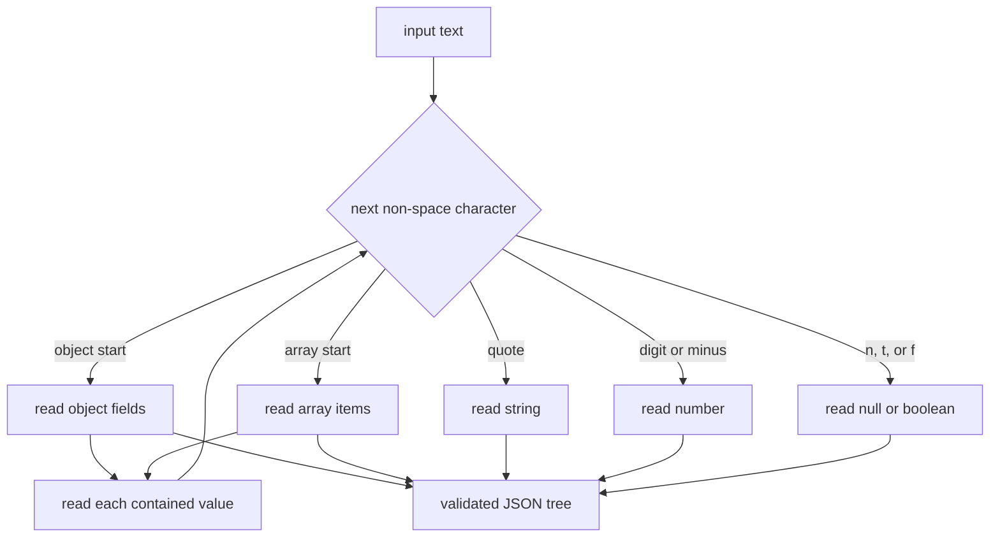

# 04: Build a dependency-free JSON codec

## Goal

Parse JSON text into a validated tree and render that tree back to text. Treat
the parser as the protocol's first security boundary.

## Before you start

Required background: the six JSON shapes and `Either` from chapters 00 and 03.
No AT Protocol terms are required yet. This chapter introduces parser, codec,
canonical rendering, and resource limit; each is explained before use.

Implementation: `src/learnat/json/Json.scala`

Tests: `src/learnat/json/Json.test.scala`

## Why JSON comes first

AT Protocol uses JSON for:

- most XRPC inputs, outputs, and errors;
- DID documents;
- Lexicon schemas;
- OAuth authorization-server and client metadata.

Repository blocks later use DAG-CBOR, but much of the data model corresponds to
JSON. Explicit `null`, boolean, number, string, array, and object types are the
foundation of every later decoder.

## Data model

```scala
enum Json:
  case Null
  case Bool(value: Boolean)
  case Num(value: BigDecimal)
  case Str(value: String)
  case Arr(value: Vector[Json])
  case Obj(fields: Vector[(String, Json)])
```

### Do not parse numbers as Double

`Double` is binary floating point and cannot exactly represent many decimal
fractions or large integers. The parser retains JSON number meaning in a
`BigDecimal`. A Lexicon integer decoder later uses `asLong` to enforce its range.

### Do not immediately collapse objects into Map

JSON object order is semantically irrelevant, but a `Vector` preserves the
observed input. The parser rejects a repeated key:

```json
{"did":"trusted","did":"attacker-controlled"}
```

Allowing duplicates can create parser differentials: signature verification
might choose the first value while business logic chooses the last. JSON in
general does not universally forbid duplicates, but this implementation rejects
them as a safe policy for untrusted protocol input.

## Recursive-descent parser

“Recursive descent” means that the function reading a container calls the same
value-reading logic for each value inside it. The name is less important than
the control flow:



The parser owns one `offset` and dispatches on the next character:

```text
n -> null
t -> true
f -> false
" -> string
[ -> array
{ -> object
- or digit -> number
```

Arrays and objects recursively parse contained values. After one document, only
whitespace may remain. Without this final check, `true malicious-data` could be
accepted by reading only its prefix.

## Strings and Unicode

JSON escapes are `\" \\ \/ \b \f \n \r \t \uXXXX`. A Unicode code point may
use two UTF-16 code units, so the parser validates high/low surrogate pairs:

```json
"Scala \uD83D\uDE80"
```

An incomplete pair, isolated low surrogate, or invalid hexadecimal digit is an
error. Parse errors retain offset, line, and column.

## Resource limits

A small but deeply nested array can exhaust the call stack; a large document
consumes memory:

```scala
Json.parse(input, Json.Limits(
  maxDepth = 128,
  maxInputChars = 2 * 1024 * 1024
))
```

The HTTP layer should also enforce endpoint-specific body limits. Parser limits
are a last line of defense, not a server-wide rate limiter.

## Keep unsafe casts out of callers

Field access also returns `Either`:

```scala
val did: Either[Json.AccessError, String] =
  document.field("did").flatMap(_.asString)
```

A missing field, non-object parent, or non-string value is an explicit `Left`.
No `asInstanceOf` or `null` is necessary.

Optional fields have a separate operation:

```scala
document.optionalField("cursor") // Either[AccessError, Option[Json]]
```

This preserves the difference between “the parent was not an object” and “the
object does not contain this field.”

## Run and observe

```console
$ nix develop --command sbt verify
```

The JSON section tests all six value kinds plus:

- Unicode surrogate-pair round trips;
- duplicate keys;
- leading zeroes and incomplete fractions/exponents;
- trailing input;
- nesting limits;
- typed field access.

## Break it deliberately

### Exercise 1: trailing input

Temporarily remove the `atEnd` check from `parseDocument` and observe how the
`true false` test changes. Restore it afterward.

### Exercise 2: duplicate-key policy

Remove the `keys` set check and observe both `did` values in the tree. Explain
which value `field("did")` returns and what happens after converting to a Map.

### Exercise 3: depth

With `maxDepth = 2`, parse `[[]]` and `[[[]]]`. Draw exactly how the parser
counts each nesting level.

## Difference from a production JSON library

The custom codec exists to expose the data model and trust boundary. General
production systems benefit from a heavily fuzzed library with streaming byte
input and performance work.

Even with a library, the application still decides:

- duplicate-key policy;
- maximum body size and nesting;
- accepted numeric range;
- unknown-field policy;
- how much parse detail is returned to a remote client.

This reference implementation remains a deliberately narrow codec because the
same tree is later converted into DAG-CBOR values.
