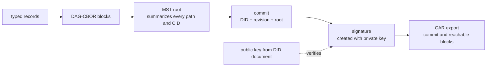

# 13: Sign and verify a complete repository

## Goal

Turn typed records into a version-3 signed repository commit and a complete CAR export. Verify it using only the expected DID, the public key from its independently resolved DID document, and the CAR bytes.

The implementation is split across:

- `src/learnat/crypto/P256.scala`
- `src/learnat/repo/Repository.scala`

## Record to commit pipeline

```text
record object
  -> canonical DAG-CBOR
  -> record CID
  -> repository path -> CID map
  -> MST node blocks and root CID
  -> unsigned commit
  -> compact low-S P-256 signature
  -> signed commit block and CID
  -> one-root CAR
```

Every arrow has a testable byte boundary.

The same pipeline as a responsibility diagram:



The signature covers the commit, not each record separately. The commit points
to the MST root, and the tree points to record CIDs, so one verified root connects
the signature to every reachable record.

## Record envelope

Repository records are DAG-CBOR maps and must be self-describing.

```scala
Ipld.obj(
  "$type" -> Ipld.Text("com.example.note"),
  "text" -> Ipld.Text("hello")
)
```

The `$type` must equal the collection NSID in the repository path. This is data-model validation, not a complete application Lexicon check.

## Version-3 commit

The unsigned value contains:

```text
did      account DID
version  fixed integer 3
data     MST root CID link
rev      monotonically increasing TID
prev     null in the current v3 producer
```

The canonical DAG-CBOR bytes of that object are signed. The final object adds `sig` as raw bytes.

The local `Repository` tracks the previous commit CID as synchronization metadata even though the current v3 producer writes `prev: null`, matching the reference implementation's compatibility behavior.

## P-256 profile

JCA provides key generation, SHA-256, and ECDSA. Protocol-specific encoding remains visible:

- public keys use compressed SEC1 P-256 points;
- Multikey prefixes the point with `p256-pub` bytes `80 24`;
- base58btc plus `z` produces `publicKeyMultibase`;
- signatures are fixed 64-byte `r || s`, not DER;
- `s` must be in the lower half of the curve order.

Low-S prevents ECDSA malleability: `(r, s)` and `(r, n-s)` are otherwise signatures for the same message. Accepting both would give the same commit two valid signature byte strings and two commit CIDs.

The tests import official ES256 fixtures and require the exact verdict for:

- valid compact low-S;
- invalid compact high-S;
- invalid DER-encoded signature.

## Atomic mutation

`Repository` is immutable. A write batch first transforms a temporary record map. Only after every create/put/delete and record envelope succeeds does it rebuild the MST and sign a new commit.

```scala
repo.applyWrites(Vector(
  RepositoryWrite.Create(...),
  RepositoryWrite.Delete(...)
))
```

If the second operation fails, no partially updated repository is returned.

## CAR verification

`RepositoryVerifier.verifyCar` performs the following chain:

1. verify CAR framing and every block CID;
2. require exactly one root and the corresponding commit block;
3. decode the exact v3 commit shape;
4. require the expected DID;
5. reconstruct and encode the unsigned commit;
6. verify the compact low-S signature;
7. walk and validate the MST;
8. require and decode every referenced record block;
9. validate every record `$type` against its collection;
10. reject unreachable extra blocks unless explicitly allowed.

The public key must come from current, independently resolved identity state. A signature is not useful if an attacker chooses both the commit and the verification key.

## Run and break it

```console
$ nix develop --command sbt verify
```

Exercises:

1. Verify a valid CAR with a newly generated attacker key.
2. Remove a record block while keeping the MST and commit.
3. Add a valid but unreachable block and compare strict/allow-extra modes.
4. Change `$type` without updating the path; then update all affected CIDs and re-sign to see semantic validation still fail.
5. Replace compact signature output with JCA DER output and run the official fixtures.

## Security boundary

The P-256 implementation is educational protocol glue around JCA, not an HSM or key-management service. A production PDS also needs encrypted key custody, backup/rotation procedures, least-privilege signing, audit logs, and incident recovery.

## Specifications

- [Repository](https://atproto.com/specs/repository)
- [Cryptography](https://atproto.com/specs/cryptography)
