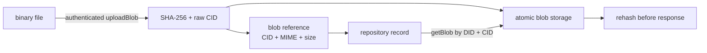

# 15: Run a minimal client-compatible PDS

## Goal

Host one account, authenticate a client, commit public records, serve repository reads and CAR exports, and publish a localhost DID document. Understand exactly why this is a learning PDS rather than an internet-ready service.

Implementation:

- `src/learnat/pds/Auth.scala`
- `src/learnat/pds/BlobStore.scala`
- `src/learnat/pds/LocalPds.scala`

## Start it

```console
$ LEARN_AT_PASSWORD=local-secret \
  LEARN_AT_HANDLE=alice.test \
  nix develop --command sbt "run pds 2583"
```

The server binds to loopback and prints:

```text
Local PDS listening at http://localhost:2583
DID: did:web:localhost%3A2583
```

Use a real password in the environment. The built-in fallback exists only to keep the learning command discoverable and must not be exposed.

By default, `LocalPdsMain` persists state under `data/local-pds`. Override it with `LEARN_AT_DATA`. Keep the same port when restarting: the port is part of the localhost `did:web` identifier, and the store fails closed if the bound DID changes.

## Identity endpoints

The PDS publishes:

```text
GET /.well-known/did.json
GET /.well-known/atproto-did
GET /xrpc/com.atproto.identity.resolveHandle
```

The DID document includes:

- `alsoKnownAs: at://alice.test`;
- a P-256 `#atproto` Multikey;
- an `#atproto_pds` service at the loopback origin.

HTTP PDS service endpoints are accepted only because the resolver is explicitly configured for localhost development.

## Supported XRPC endpoints

Server/identity:

```text
com.atproto.server.describeServer
com.atproto.identity.resolveHandle
com.atproto.server.createSession
com.atproto.server.getSession
com.atproto.server.refreshSession
com.atproto.server.deleteSession
```

Repository/sync:

```text
com.atproto.repo.getRecord
com.atproto.repo.listRecords
com.atproto.repo.createRecord
com.atproto.repo.putRecord
com.atproto.repo.deleteRecord
com.atproto.repo.uploadBlob
com.atproto.repo.describeRepo
com.atproto.sync.getRepo
com.atproto.sync.getLatestCommit
com.atproto.sync.getBlob
```

Public reads do not require a token. Mutations require an access-scoped bearer token for the hosted DID.

## Blob upload and retrieval

A record remains small and refers to large binary content by a raw CID:



`AuthenticatedAtpClient.uploadBlob` sends the exact bytes with a simple
`type/subtype` Content-Type. The local PDS caps input at 5 MiB, calculates a raw
CID, deduplicates identical content, and returns a typed `BlobRef` that can be
inserted into an IPLD record with `asIpld`.

Persistent mode stores blob bytes and MIME metadata under `data/blobs` using
write-then-rename replacement. `getBlob` validates the requested hosted DID and
raw CID. Both the server store and client download recompute the CID before
returning bytes. Missing sidecars, oversized files, wrong codecs, and modified
disk content fail closed.

This is a complete local content-addressed path, not a production media
pipeline. It deliberately lacks image transcoding, MIME sniffing, malware
scanning, per-account quotas, reference counting, garbage collection, CDN
delivery, and moderation isolation. Those are separate operational gates in
chapter 19.

## Passwords and sessions

Passwords are stored as PBKDF2-HMAC-SHA-256 with:

- a random 128-bit salt;
- at least 100,000 iterations (210,000 by default);
- a 256-bit derived value;
- constant-time verification.

The encoded format is versioned and round-trip tested.

Legacy access and refresh values are HS256 JWT-shaped tokens with DID, scope, issue/expiry time, and a random JTI. Access and refresh scopes are not interchangeable. Refresh rotates and revokes the previous JTI; explicit revocation and expiration are tested.

This is not the atproto OAuth profile. It is the deliberately earlier legacy-auth learning step.

## Request boundaries

The HTTP adapter enforces:

- exact method per route;
- `application/json` for JSON procedures;
- a configurable JSON body byte limit;
- typed JSON/identifier/IPLD decoding;
- repository ownership on every read/write parameter;
- bounded worker threads;
- structured XRPC error bodies;
- no-store response caching.

Repository state changes only after an immutable atomic write returns a signed commit.

## Local persistence

The optional state store persists:

- the DID that owns the state;
- PKCS#8 P-256 private key and public Multikey;
- the last repository revision TID;
- typed record collection/key/value triples;
- the bounded suffix of canonical firehose frames and their sequence numbers.

Repository data and retained events share version 2 of the state document. A
write first constructs an unpublished event, then creates a complete temporary
JSON file, applies owner read/write permissions on POSIX systems, forces the file
to storage, and atomically renames it where the filesystem supports atomic
moves. Only then does the PDS publish the event and advance in-memory state.
Version 1 remains readable and starts with an empty event history.

On restart, the server requires the stored DID to match the bound `did:web`
origin, restores the signing key, records, and canonical event suffix, and
continues both repository revisions and event sequences. Invalid CBOR frames or
non-contiguous event sequences fail startup instead of silently resetting a
consumer cursor.

The JSON format is intentionally inspectable for the hands-on. Its PKCS#8 private key is plaintext and protected only by filesystem permissions; production key custody must replace it.

## What the E2E test proves

A passing test proves that, in one process on loopback:

```text
client JSON
  -> XRPC HTTP
  -> auth and record validation
  -> DAG-CBOR record
  -> MST rebuild
  -> P-256 signed commit
  -> public read
  -> CAR export
  -> independent signature/tree/record verification
```

It does not prove internet-safe deployment.

## Production gaps

Do not expose this server publicly without replacing or adding:

- multi-account transactional storage and encrypted/HSM-backed key custody;
- HTTPS termination with trusted proxy/header policy;
- OAuth discovery, PAR, PKCE, DPoP, nonce handling, and permissions;
- account creation/recovery/migration and PLC rotation-key custody;
- production blob validation, quotas, garbage collection, and media isolation;
- a bounded per-connection firehose backpressure queue;
- rate limits, abuse/spam controls, moderation, and takedowns;
- SSRF-hardened identity resolution;
- metrics, structured logs, tracing, backup, restore, and disaster drills;
- fuzzing and an external security review.

These are explicit later steps, not hidden behind the phrase "minimal PDS."

## Exercises

1. Send a mutation with no token, an access token, and a refresh token; compare errors.
2. Lower `maxJsonBodyBytes` and verify a large record is rejected before JSON parsing.
3. Restart on a different port and inspect the stored-DID mismatch. Then restart on the original port and confirm the key, records, and increasing revision survive.
4. Add conditional write CIDs (`swapCommit`/`swapRecord`) before concurrent clients.
5. Add a second account and identify every single-account assumption that must move into storage keys.

## Specifications

- [Accounts](https://atproto.com/specs/account)
- [HTTP API (XRPC)](https://atproto.com/specs/xrpc)
- [Repository](https://atproto.com/specs/repository)
- [Sync](https://atproto.com/specs/sync)
