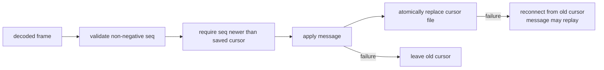

# 16: Mirror a repository and decode the firehose

## Goal

Keep a local, authenticated view of an account repository. Learn why a full
CAR resync and a resumable event stream are complementary rather than competing
sync mechanisms.

Implementation:

- `src/learnat/sync/Sync.scala`
- `src/learnat/sync/CursorStore.scala`
- `src/learnat/ipld/Ipld.scala`
- `src/learnat/client/AtpClient.scala`

## Two sync paths

An atproto consumer needs both paths:

```text
bootstrap or cursor gap                    steady state
-----------------------                    ------------
getLatestCommit                           subscribeRepos(cursor)
        |                                         |
        v                                         v
getRepo -> complete CAR                    framed commit events
        |                                         |
        v                                         v
verify commit + signature + MST            apply and verify new blocks
        |                                         |
        +----------------> local view <------------+
```

The full export is deliberately the first implementation. It is less efficient,
but it establishes the recovery operation that remains necessary when events
were missed, a cursor is no longer available, or incremental state is suspect.

## A transactional mirror

`RepositoryMirror.syncOnce` performs this sequence:

1. Call `com.atproto.sync.getLatestCommit`.
2. Return `Unchanged` when both advertised CID and revision match the snapshot.
3. Download `com.atproto.sync.getRepo` as raw CAR bytes.
4. Verify every block CID, the signed commit, the DID, the P-256 signature, the
   reachable MST, record paths, and record blocks.
5. Reject a repository revision too far in the future.
6. Replace the snapshot only after every check succeeds.

The last rule is the important state boundary. A network error, malformed CAR,
missing block, wrong signing key, or invalid tree returns an error without
partially changing the materialized view.

The verifier currently receives a trusted public key explicitly. A production
consumer obtains the current `#atproto` verification method from the DID
document and must handle DID/key rotation policy between checkpoints.

## Try polling against the local PDS

The end-to-end test starts the PDS, synchronizes an empty repository, writes a
record through the authenticated client, and synchronizes again:

```console
$ nix develop --command sbt 'verify'
```

Look for `Repository synchronization` in the output. Then read
`SyncTests.scala` beside `RepositoryMirror`: the test using a wrong key proves
that failed verification leaves the mirror empty.

The local PDS implements `getLatestCommit` and `getRepo`, so this polling path is
fully executable. It does **not** yet publish a WebSocket event stream.

## Event-stream framing

`com.atproto.sync.subscribeRepos` uses a WebSocket binary message containing
two concatenated DAG-CBOR values, without an outer array:

```text
CBOR header map || CBOR body
```

A normal message header has:

```json
{"op": 1, "t": "#commit"}
```

An error frame has `op = -1`; its body contains an `error` string and an
optional `message`. `DagCbor.decodeSequence` decodes concatenated values while
preserving the canonical-CBOR checks already used for repository data.

`EventStreamCodec` requires exactly two values, an integer operation, and a
`#`-prefixed message type. `FirehoseClient`:

- converts an HTTP(S) PDS origin into WS(S);
- calls `/xrpc/com.atproto.sync.subscribeRepos` with an optional cursor;
- assembles fragmented binary WebSocket messages;
- rejects frames over 5 MiB;
- rejects unexpected text frames;
- decodes before invoking application code.

The callback still receives generic IPLD. A later application layer should
dispatch on the event type and validate its body against the corresponding
Lexicon schema before applying it.

## Cursor state machine

A practical consumer should persist the event cursor only after its durable
state update succeeds:

```text
connect(saved cursor)
        |
        v
decode -> verify -> durable apply -> save cursor
  |          |             |
  +--error---+-------------+----> reconnect with backoff
                              \
                               +-> full resync if cursor cannot resume
```

Do not save the cursor immediately after receiving a frame. A crash between the
cursor write and data write would permanently skip that event. Either commit
both in one storage transaction or make event application idempotent and write
the cursor last.

## Durable at-least-once checkpoint

`CheckpointedFrameHandler` implements the safe ordering used by a consumer:



`FileCursorStore` writes one non-negative base-10 sequence to a temporary file
and then renames it over the checkpoint. It rejects corrupt and oversized state.
`ATOMIC_MOVE` is used when the filesystem supports it.

The ordering chooses at-least-once delivery. It avoids event loss: failed
application never advances the cursor. If application succeeds but the cursor
write fails, the event can be delivered again after restart. Therefore the
application callback must be idempotent, or its materialized state and cursor
must share a stronger external transaction. Tests cover both crash boundaries.

## Exercises

1. Change one byte in an exported CAR and confirm the mirror keeps its previous
   snapshot.
2. Return an advertised revision newer than the exported commit and observe the
   consistency failure.
3. Feed `EventStreamCodec` one, two, and three concatenated CBOR values.
4. Add exponential backoff with jitter and a cancellation handle around
   `FirehoseClient`.
5. Replace the file checkpoint with a database transaction shared by an
   idempotent materialized view.
6. Add the local PDS WebSocket producer and test reconnecting from a cursor.

## What is still missing

This chapter provides a verified full-repository mirror, real WebSocket
consumer/framing, and durable at-least-once cursor checkpoint. It does not yet
implement incremental commit semantics, blob transfer, local Relay behavior,
server-side cursor retention, backpressure queues, or the local PDS firehose
producer. Those omissions are explicit: durable receipt alone is not yet a
complete indexing service.

## Specifications

- [Sync](https://atproto.com/specs/sync)
- [Event Stream](https://atproto.com/specs/event-stream)
- [Repository](https://atproto.com/specs/repository)
- [HTTP API (XRPC)](https://atproto.com/specs/xrpc)
