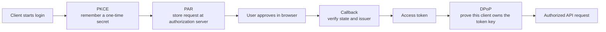

# 17: Move from legacy sessions to OAuth

## Goal

Understand why a password-to-bearer-token exercise is not sufficient for a
user-facing atproto client. Build and test the security bindings used by the
atproto OAuth profile: discovery, account/issuer binding, state, PKCE, PAR,
callback issuer verification, DPoP, token parsing, nonce rotation, and replay
rejection.

Implementations:

- `src/learnat/pds/Auth.scala`
- `src/learnat/oauth/OAuth.scala`
- `src/learnat/oauth/AuthorizationFlow.scala`
- `src/learnat/oauth/Dpop.scala`

## Before the acronyms

OAuth lets a client receive limited authority without learning the user's
password. The extra acronyms protect different moments in that flow:



Do not memorize the expansions first. Follow the attack each box prevents: PKCE
protects a stolen code, state protects a mismatched callback, issuer binding
protects server confusion, and DPoP makes a copied token insufficient by itself.

## Two different authentication systems

### Legacy session

The local PDS supports the earlier teaching path:

```text
identifier + password
        |
        v
com.atproto.server.createSession
        |
        +--> access JWT-shaped bearer value
        +--> refresh JWT-shaped bearer value
```

It is useful for observing password verification, token scope, expiry,
rotation, revocation, and the `Authorization` header. It also exposes the main
weakness: client software receives a reusable password and the access token is a
bearer credential. Whoever copies it can replay it.

The local implementation improves the exercise with PBKDF2-HMAC-SHA-256,
constant-time password comparison, separate access/refresh scopes, short access
lifetime, single-use refresh rotation, JTI revocation, and a random HMAC key.
Those properties do not turn it into OAuth.

### Atproto OAuth

OAuth delegates a bounded set of permissions without giving the client the
account password. The profile requires:

- authorization code grant only;
- PKCE S256 for every authorization;
- Pushed Authorization Requests (PAR);
- public client metadata addressed by an HTTPS `client_id` URL;
- no shared `client_secret`;
- DPoP-bound access and refresh tokens;
- mandatory server-issued DPoP nonces;
- account DID and authorization-server issuer verification.

OAuth is the target for browser, mobile, desktop, and backend user-facing
clients.

## Participants and discovery

OAuth separates two server roles:

- the PDS is the Resource Server that receives authorized XRPC calls;
- an Authorization Server authenticates the user and issues tokens.

They may share an origin, but an entryway can authorize accounts for a separate
PDS. Never assume equality.

```text
verified handle/DID
        |
        v
DID document -> PDS origin
        |
        v
/.well-known/oauth-protected-resource
        |
        v
authorization_servers[0]
        |
        v
/.well-known/oauth-authorization-server
```

`OAuthMetadata` parses both documents. It requires a simple HTTPS origin,
binds the protected `resource` to the PDS origin that was fetched, binds the
authorization `issuer` to its fetched origin, and checks the atproto capability
profile:

```text
code + authorization_code + refresh_token
PKCE S256
public none + confidential private_key_jwt
ES256 client assertions
scope atproto
authorization response iss
required PAR
ES256 DPoP
client ID metadata documents
```

Only explicit localhost development permits HTTP.

The parser does not fetch URLs. A production discovery adapter must additionally
enforce no redirects where the metadata contract requires status 200, strict
content type and byte/deadline limits, private-address blocking, DNS-rebinding
checks, and short auth-flow identity caches.

## Bind account identity to the issuer

An OAuth server asserting `sub = did:plc:victim` is not enough. A malicious
server can write that string too.

When login starts with a handle or DID:

1. resolve and bidirectionally verify the account;
2. retain the resolved DID in server-side/session-local state;
3. discover the PDS and authorization issuer from that identity;
4. bind the issuer and DID to the authorization session;
5. after token exchange, require token `sub` to equal the retained DID.

When login starts from a server, the final `sub` must be resolved in the other
direction: its DID document must lead to the same PDS and issuer. This prevents
issuer/account mix-up.

`OAuthTokenResponse.parse` requires `token_type = DPoP`, a positive lifetime,
an explicit `scope` containing `atproto`, and optionally an exact expected DID.
Access and refresh strings remain opaque to the client.

## State is a lookup key, not session storage

`OAuthState.generate` produces 256 random bits. Persist the actual session data
under that key:

```text
state -> expected DID, issuer, redirect URI, PKCE verifier,
         DPoP private key, requested scopes, creation/expiry
```

Do not serialize that data into the `state` parameter. Callback values travel
through an untrusted browser and logs. State must be unpredictable, unique, and
single-use.

## PKCE

`PkcePair.generate` creates a 32-byte random verifier, rendered as 43 unpadded
base64url characters. The public challenge is:

```text
BASE64URL(SHA-256(ASCII(code_verifier)))
```

The client sends `code_challenge` and `code_challenge_method=S256` in PAR, keeps
the verifier private, and sends `code_verifier` only during token exchange. A
party that steals the browser authorization code cannot exchange it without the
verifier.

The test suite includes the RFC 7636 S256 example, not only a self-consistent
round trip.

## Pushed Authorization Request

`AuthorizationRequest` validates the client ID, redirect URI, unique scopes,
mandatory `atproto` scope, state, PKCE, and optional login hint. Its form body
contains:

```text
client_id
response_type=code
redirect_uri
scope
state
code_challenge
code_challenge_method=S256
login_hint (optional)
```

Submit it as `application/x-www-form-urlencoded` to the discovered PAR endpoint,
with a DPoP proof. The server returns a short-lived `request_uri` and a
`DPoP-Nonce` header. The browser redirect is deliberately reduced to:

```text
authorization_endpoint?client_id=...&request_uri=...
```

Sensitive request details remain in the authorization server's PAR state
instead of the browser URL.

The first DPoP attempt may have no server nonce yet. The authorization server
can answer with `use_dpop_nonce` and `DPoP-Nonce`; retry once with a new proof
containing that nonce. Every response to a DPoP request must provide a nonce.

## Callback verification

The browser returns `code`, `state`, and `iss`, or an OAuth error. Verify before
exchanging anything:

1. reject duplicate query parameters;
2. constant-time compare `state` with a live single-use session;
3. require `iss` to equal the bound authorization issuer;
4. require exactly one non-empty `code` or `error`;
5. atomically consume state so the callback cannot replay.

`AuthorizationCallback.parse` implements the value checks. Atomic state
consumption belongs to the client session store.

`TokenRequest.authorizationCode` sends the code, client ID, redirect URI, and
PKCE verifier. `TokenRequest.refresh` models refresh-token exchange. Because
atproto refresh tokens are normally single-use, callers must serialize refresh
per session and atomically replace both returned tokens.

## DPoP proof of possession

A DPoP access token is useful only with a JWT signed by the private session key.
`DpopProof` generates a fresh JTI and signs with ES256:

```json
{
  "typ": "dpop+jwt",
  "alg": "ES256",
  "jwk": {"kty":"EC","crv":"P-256","x":"...","y":"..."}
}
```

```json
{
  "jti": "fresh random value",
  "htm": "POST",
  "htu": "https://pds.example/xrpc/com.example.write",
  "iat": 1750000000,
  "nonce": "server nonce",
  "ath": "base64url(sha256(access token))"
}
```

`htu` excludes query and fragment. `ath` is present for Resource Server calls
and absent for PAR/token calls. The JWT signature is the fixed 64-byte ES256
JWS form, which reuses the repository chapter's low-S P-256 implementation.

The public JWK has no private `d` value. `P256Jwk.parse` verifies 32-byte x/y
coordinates and proves they describe the same P-256 curve point. Its RFC 7638
thumbprint is the token-binding identity (`jkt`).

## Server-side verification

`DpopVerifier` checks in a deliberate order:

1. maximum JWT size and exactly three segments;
2. strict UTF-8 JSON header/payload;
3. `typ`, `alg`, public JWK, and curve point;
4. ES256 signature over the exact encoded segments;
5. JTI, method, normalized target URI, and issuance window;
6. required server nonce;
7. access-token hash presence/absence and value;
8. replay cache insertion only after every earlier check passes.

`DpopReplayCache` is bounded and fails closed when full. It does not evict a
still-live JTI, because eviction would make an earlier proof replayable.

`DpopNonceManager` generates 256-bit values, caps lifetime at the profile's
five-minute maximum, rotates, and briefly accepts the previous nonce so
concurrent in-flight requests do not all fail at the rotation boundary.

These utilities implement both client proof creation and server verification.
The local PDS does not yet use them as a full OAuth Authorization Server.

## Permission scopes

Every session includes `atproto`. Authentication-only clients can request only
that scope. Transitional `transition:generic` is broad and exists for migration;
it is not the long-term least-privilege model.

The newer permission system can describe record collections/actions and RPC
methods/audiences. Servers must treat unknown permission fields conservatively:
ignoring a future attenuation field and granting the rest could widen access.

Always compare granted scopes from the token response with what the application
needs. The user may approve less than requested.

## Implemented boundary

| Capability | Status |
| --- | --- |
| legacy password/session server | executable in local PDS |
| protected-resource and authorization metadata parsing | implemented and tested |
| state, PKCE, PAR form, browser URI, callback checks | implemented and tested |
| code/refresh request and token response models | implemented and tested |
| DPoP JWK, proof signing, verification, nonce, replay | implemented and tested |
| hardened live metadata fetch | remaining |
| browser launch/callback listener and durable session store | remaining |
| HTTP PAR/token exchange with nonce retry | remaining |
| confidential-client `private_key_jwt` | remaining |
| complete local OAuth Authorization Server and approval UI | remaining |

The implemented primitives are useful security-critical units, not a claim that
the repository already provides a production login product.

## Exercises

1. Change one DPoP claim at a time and identify the exact verifier stage.
2. Send the same valid proof twice through one replay cache.
3. Simulate two simultaneous single-use refreshes and add a per-session lock.
4. Build a fake PAR/token HTTP server that first returns `use_dpop_nonce`, then
   prove the client retries once with a different proof/JTI.
5. Persist an authorization session encrypted at rest, consume state atomically,
   and test a crash before and after token replacement.
6. Add confidential-client ES256 assertions with issuer/subject `client_id`,
   authorization-server audience, unique JTI, and key rotation.
7. Integrate DPoP verification into a separate local OAuth server port; keep the
   legacy local-PDS route visibly distinct.

## Specifications

- [AT Protocol OAuth](https://atproto.com/specs/oauth)
- [AT Protocol permissions](https://atproto.com/specs/permissions)
- [RFC 7636: PKCE](https://www.rfc-editor.org/rfc/rfc7636)
- [RFC 9126: PAR](https://www.rfc-editor.org/rfc/rfc9126)
- [RFC 9449: DPoP](https://www.rfc-editor.org/rfc/rfc9449)
- [RFC 8414: Authorization Server Metadata](https://www.rfc-editor.org/rfc/rfc8414)
