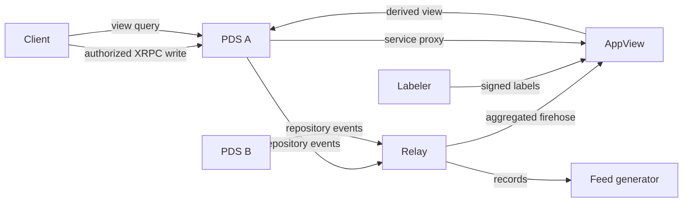

# 18: Place the PDS in a federated system

## Goal

Explain what changes when one verified account repository becomes an input to a
Relay, AppView, feed generator, and Labeler. Run a two-PDS isolation lab, then
design the missing event/indexing boundary without assigning every network role
to the PDS.

## Roles, not one monolith



The roles have distinct source-of-truth rules:

| Component | Authoritative for | Not authoritative for |
| --- | --- | --- |
| DID system | current identity document | repository record contents |
| PDS | account writes and current repository service | global search/ranking |
| signed repository | public account records at a commit | handle freshness or private account state |
| Relay | event distribution and discovery policy | application semantics |
| AppView | its derived index and algorithms | original account repository |
| Labeler | labels signed by its DID | universal moderation truth |
| client | user interaction and selected services | server-side account key custody |

A practical implementation can colocate processes, but it should not erase
these trust boundaries.

## Relay

A Relay subscribes to many PDS event streams and exposes an aggregated stream.
It reduces the number of direct connections an AppView must maintain. A Relay
still treats repositories as independently verifiable content:

```text
PDS event
  -> decode event framing
  -> identify repository DID and revision
  -> verify blocks/commit or schedule a full resync
  -> emit according to Relay crawl and retention policy
```

The Relay may filter which hosts it crawls or events it redistributes. That is a
network policy, not cryptographic proof that a rejected repository was invalid.

The current `FirehoseClient` connects to a `subscribeRepos` endpoint and decodes
frames. `RepositoryMirror` performs the recovery path with `getLatestCommit`
and a complete verified CAR. The local PDS does not yet publish the WebSocket
stream, and this project does not implement an aggregated Relay.

## AppView

An AppView consumes records it understands and builds derived read models:

- profile joins and counters;
- thread structure;
- search indices;
- follows, likes, and repost aggregates;
- ranking inputs and feeds.

Treat its database as rebuildable derived state. A safe indexer stores at least:

```text
repository DID
record collection and key
record CID (content version)
repository revision/commit checkpoint
decoded application fields
deletion/tombstone state
```

Event application must be idempotent. A replay of the same record CID should
not increment a counter twice. A delete must be ordered relative to an update.
After a cursor gap, replace repository-derived rows from a newly verified
snapshot or reconcile them transactionally.

Lexicon validation is necessary but not sufficient. The AppView also applies
application rules—for example, whether a referenced record exists, whether a
timestamp is reasonable, or whether content should be indexed at all.

## Service proxying

Clients often call an AppView through their PDS. The PDS can route a request to
a selected service while preserving account authorization.

Do not implement proxying as “forward any user-supplied URL.” Bind the target to
a DID service identity and a permitted Lexicon method. Decide explicitly:

- which service DID/audience is allowed;
- which XRPC NSID is being invoked;
- which OAuth `rpc` permission grants it;
- which headers can cross the boundary;
- how response sizes, timeouts, and errors are bounded;
- whether the PDS or client connects directly.

This is an SSRF and confused-deputy boundary.

## Feed generators

A feed generator returns an ordered skeleton of AT URIs. An AppView can hydrate
those references into complete views. The generator's algorithm is not part of
repository consensus and can be replaced without moving account data.

Separate:

```text
speech: signed records an account publishes
reach:  selection, ordering, filtering, and presentation
```

The distinction permits algorithmic choice. It does not remove the need for
abuse policy at PDS, Relay, AppView, and client layers.

## Labels and moderation

A label is a standalone, self-authenticating annotation. Its source DID says who
made the assertion; its subject URI/DID says what it applies to; an optional CID
can pin one exact record version. Consumers choose which Labeler DIDs and label
semantics they trust.

```text
signed label != deletion of the original repository record
label policy  != cryptographic validity of the record
```

A PDS may enforce account-level policy, a Relay may stop redistributing a host,
an AppView may exclude content from search, and a client may hide or warn. Keep
those actions observable and attributable.

## Two-PDS isolation lab

Start two independent local servers in separate terminals:

```console
$ LEARN_AT_PASSWORD=alice-secret \
  LEARN_AT_HANDLE=alice.test \
  LEARN_AT_DATA=data/alice \
  nix develop --command sbt "runMain learnat.Main pds 2583"
```

```console
$ LEARN_AT_PASSWORD=bob-secret \
  LEARN_AT_HANDLE=bob.test \
  LEARN_AT_DATA=data/bob \
  nix develop --command sbt "runMain learnat.Main pds 2584"
```

Write one record to each:

```console
$ LEARN_AT_PASSWORD=alice-secret nix develop --command sbt \
  'runMain learnat.Main client post http://localhost:2583 alice.test com.example.note "from Alice"'
```

```console
$ LEARN_AT_PASSWORD=bob-secret nix develop --command sbt \
  'runMain learnat.Main client post http://localhost:2584 bob.test com.example.note "from Bob"'
```

List each collection and export both CAR files. Confirm:

- different `did:web` values because the ports differ;
- different repository signing keys and commit CIDs;
- no record leakage between state directories;
- each PDS can be read without the other running;
- each CAR is a complete independent account snapshot.

This proves account-host isolation and portable repository representation. It
does **not** prove federation: no Relay discovers the PDS instances, no firehose
producer delivers events, no AppView joins their records, and `.test` identities
are intentionally local.

## Migration thought experiment

Repository portability is only one part of account migration:

1. continuously mirror and verify the source repository;
2. transfer blobs as well as repository blocks;
3. preserve signing/rotation authority according to the DID method;
4. import account state at the destination;
5. update the DID document's PDS service;
6. re-resolve and verify the new location;
7. resume events without accepting a revision rollback;
8. retain recovery and audit evidence.

A CAR backup without blobs, rotation authority, or a tested restore path is not
a complete migration plan.

## Exercises

1. Build a small in-memory AppView table keyed by `(DID, collection, rkey)` and
   apply two complete `MirrorSnapshot` values idempotently.
2. Simulate update, duplicate update, delete, and out-of-order delivery.
3. Add a local WebSocket producer with sequence cursors to each PDS, then merge
   both streams in a toy Relay without changing repository verification.
4. Introduce a cursor gap and prove the consumer performs a full CAR resync.
5. Define a Labeler trust configuration where two sources disagree; keep both
   signed assertions while producing a deterministic client decision.
6. Design a service-proxy allowlist using service DID, audience, and NSID—not a
   raw destination URL.

## References

- [Protocol overview](https://atproto.com/guides/overview)
- [Sync](https://atproto.com/specs/sync)
- [Event Stream](https://atproto.com/specs/event-stream)
- [Labels](https://atproto.com/specs/label)
- [Account migration](https://atproto.com/guides/account-migration)
