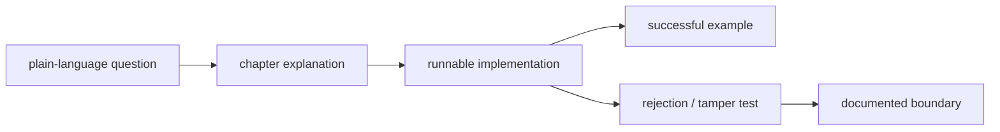

# Explanation and implementation coverage

## What “complete” means here

This repository is a reference implementation for learning AT Protocol internals.
Completeness therefore has two separate meanings:

1. **Reference-scope completeness:** every capability claimed by the learning
   path has prose, runnable implementation, positive tests, rejection tests, and
   an explicit trust or resource boundary.
2. **Production-service completeness:** everything needed to operate an
   internet-facing multi-user PDS, Relay, AppView, and authorization service.

The first is the acceptance target of this repository and is covered below. The
second cannot honestly be claimed by a single-process teaching project; chapter
19 lists the additional engineering and organizational evidence it requires.
Calling those operational requirements “implemented” without deployment,
security review, recovery drills, and abuse operations would make the guide less
complete, not more.

## Required evidence for a covered topic

A row is marked covered only when all five links in this chain exist:

- **Explanation** introduces prerequisites and defines new words before relying
  on them.
- **Implementation** performs the actual bytes, validation, state transition, or
  network call rather than returning a canned example.
- **Positive evidence** proves an interoperable or end-to-end success path.
- **Negative evidence** corrupts input, authority, ordering, size, or state and
  proves rejection.
- **Boundary** states what remains unsafe or intentionally outside the reference
  scope.

## Coverage matrix

| Topic | Explanation | Implementation | Executable specification | Status |
| --- | --- | --- | --- | --- |
| dependency-ordered reading map | `00-learning-path.md` | source tour and chapter links | `verifyCoverage` checks matrix membership | covered |
| minimum web/crypto background | `00-prerequisites.md` | exercised through later boundaries | later HTTP, hash, and signature tests | covered |
| system actors and data flow | `01-mental-model.md` | client, local PDS, mirror | `LocalPdsE2e.test.scala`, `Sync.test.scala` | covered |
| reproducible environment | `02-environment.md` | Nix flake and sbt tasks | CI runs `sbt verify` | covered |
| Scala error/state model | `03-scala-foundations.md` | typed values throughout `src/learnat` | all adjacent tests | covered |
| JSON | `04-json.md` | `json/Json.scala` | `json/Json.test.scala` | covered |
| identifiers | `05-identifiers.md` | `syntax/Identifiers.scala` | syntax and official interoperability tests | covered |
| XRPC over HTTP | `06-xrpc.md` | `xrpc/Xrpc.scala` | `xrpc/Xrpc.test.scala` | covered |
| handle/DID resolution | `07-identity.md` | `identity/Identity.scala` | `identity/Identity.test.scala` | covered |
| Lexicon parsing/validation | `08-lexicon.md` | `lexicon/` | `lexicon/Lexicon.test.scala` | covered |
| IPLD and DAG-CBOR | `09-dag-cbor.md` | `ipld/Ipld.scala` | `ipld/Ipld.test.scala` | covered |
| CID, multihash, varint, base32 | `10-cid.md` | `ipld/Ipld.scala` | CID section of `ipld/Ipld.test.scala` | covered |
| CAR v1 | `11-car.md` | `ipld/Car.scala` | `ipld/Car.test.scala` | covered |
| Merkle Search Tree | `12-mst.md` | `repo/Mst.scala` | canonical fixture and tamper tests in `repo/Mst.test.scala` | covered |
| P-256 and signed repository | `13-signed-repository.md` | `crypto/P256.scala`, `repo/Repository.scala` | official crypto and repository tests | covered |
| typed client and CLI | `14-client.md` | `client/` | adjacent CLI tests and real-socket PDS E2E tests | covered |
| persistent local PDS | `15-local-pds.md` | `pds/` | auth, persistence, corruption, and E2E tests | covered for one account |
| full-CAR mirror, event decoding, durable cursor | `16-sync.md` | `sync/Sync.scala`, `sync/CursorStore.scala` | mirror, framing, corruption, and crash-boundary tests | covered; producer excluded below |
| OAuth/DPoP protocol primitives | `17-oauth.md` | `oauth/` | discovery, binding, replay, nonce, and signature tests | covered as primitives |
| federation roles and lab | `18-federation.md` | two-PDS isolation and sync components | PDS E2E and sync suites | covered as a lab |
| production review | `19-production-readiness.md` | evidence checklist, not a deployment claim | CI is evidence only for code-level gates | covered as an assessment |

Paths in the matrix are relative to `docs/` or `src/learnat/`. Tests are
colocated with implementations and use the `.test.scala` suffix.

## Public entry points and their contracts

The implementation is divided into these public boundaries:

| Boundary | Inputs | Successful output | Primary rejected conditions |
| --- | --- | --- | --- |
| `Json.parse` | untrusted text and limits | typed JSON tree | grammar, duplicate keys, depth/size, trailing input |
| identifier parsers | untrusted strings | distinct DID/handle/NSID/URI/key/TID types | invalid grammar, traversal, overflow |
| `XrpcClient` | origin, NSID, parameters/body | typed JSON or bounded bytes | invalid origin, status/error body, malformed/oversized response |
| `IdentityResolver` | handle or DID | mutually verified identity and PDS origin | unsupported method, bad DNS/HTTPS claim, mismatched document |
| `LexiconValidator` | schema registry and value | validated value plus warnings | unresolved/cyclic refs, wrong type/range/format |
| `DagCbor` / `Cid` / `Car` | IPLD or untrusted bytes | canonical blocks and verified archives | non-canonical bytes, hash mismatch, duplicate/oversized blocks |
| `Mst` / `RepositoryVerifier` | record paths, blocks, key | reachable authenticated repository | wrong layer/path/CID/signature/DID, missing or extra blocks |
| `AtpClient` | service or resolved identity | typed reads and writes | malformed responses, invalid identifier/data, XRPC failures |
| `AuthenticatedAtpClient` | immutable legacy session | writes, refresh replacement, revocation | wrong scope, expired/reused/revoked token |
| `LocalPds` | loopback configuration and requests | persistent one-account repository service | auth, method, size, schema, storage corruption |
| `RepositoryMirror` | PDS client, DID, public key | atomically replaced verified snapshot | rollback/future revision, network, CAR, key, repository failure |
| OAuth/DPoP types | metadata, callback/token/proof fields | bound authorization values | issuer/state/nonce/time/signature/replay mismatch |

Scaladoc on each public boundary explains semantics that the Scala type cannot:
trust source, mutation/rotation behavior, canonical form, limits, or failure
atomicity. Private helpers are documented only where the algorithm would
otherwise be unclear.

## Explicitly excluded from reference-scope completeness

These are not hidden TODOs. They are separate systems or production milestones:

| Excluded capability | Why it is not honestly completed here | Where to continue |
| --- | --- | --- |
| multi-account database and concurrent writers | requires transactional schema, migrations, locking, quota, and recovery design | chapter 19, gates 3–5 |
| blob upload/serving pipeline | requires storage lifecycle, MIME verification, malware/media isolation, quotas, and garbage collection | chapters 15 and 19 |
| local WebSocket firehose producer | consumer framing is covered, but durable event retention and cursor policy must be designed together | chapter 16 exercises |
| incremental repository application | full verified resync is the implemented recovery oracle; incremental operations need durable idempotency | chapter 16 |
| browser OAuth authorization service | primitives are covered; UI sessions, consent, client metadata policy, recovery, and abuse controls are an internet service | chapter 17 and chapter 19 gate 6 |
| Relay/AppView/Labeler at internet scale | indexing and moderation are independently operated products, not PDS helper classes | chapter 18 |
| production TLS, KMS, rate limits, backup, SLO, moderation, compliance | these require infrastructure and organizational evidence, not additional sample methods | chapter 19 |

If one of these becomes a project goal, it should receive its own chapter,
storage/security design, executable success and failure tests, and a change to
this matrix. Until then, the guide must not imply that the local PDS is safe for
public deployment.

## How to keep coverage complete

For every new public capability:

1. add it to the matrix;
2. link the chapter, implementation, and adjacent test;
3. include at least one rejection or corruption case;
4. state resource and trust boundaries;
5. run `nix develop --command sbt verify` locally;
6. require the same command in GitHub Actions.

Review this file whenever a chapter, public method, endpoint, or claimed target
skill changes.

The `verifyCoverage` build task prevents two common forms of silent drift: a
numbered chapter omitted from this matrix, and an implementation directory with
no colocated `.test.scala` file. It runs as part of `verify` locally and in CI.
