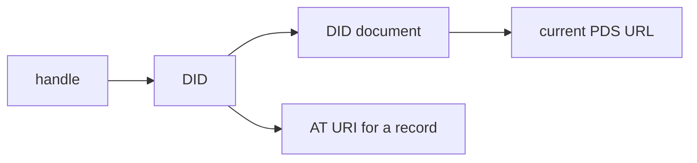

# Glossary in plain language

Use this page as a lookup table, not as something to memorize. “Plain meaning”
is intentionally approximate; the linked chapter supplies the precise rules.

## People, programs, and servers

| Term | Plain meaning | Why it matters | First explained |
| --- | --- | --- | --- |
| account | one protocol identity and its stored public records | a person may move the account between servers | [01](01-mental-model.md) |
| client | an app or command that acts for a user | it sends HTTP requests but does not own repository truth | [prerequisites](00-prerequisites.md) |
| PDS | the account server; short for Personal Data Server | authenticates writes and stores the account repository | [01](01-mental-model.md) |
| Relay | an update collector for many PDS instances | lets indexers follow one aggregated stream | [18](18-federation.md) |
| AppView | a read-optimized application index | builds feeds, search, threads, and aggregated profiles | [18](18-federation.md) |
| Labeler | a service publishing moderation judgements | cryptographic validity does not imply acceptable content | [18](18-federation.md) |

## Names and addresses

| Term | Plain meaning | Example | Can it change? |
| --- | --- | --- | --- |
| handle | human-readable account name | `alice.example.com` | yes |
| DID | stable machine-readable account identity | `did:plc:abc...` | normally remains the account identity |
| DID document | current identity description | lists a PDS URL and public key | yes |
| URL | address contacted over the network | `https://pds.example/xrpc/...` | yes |
| AT URI | address of an account record, independent of server location | `at://did:plc:abc/app.example.note/3l...` | record identity stays; contents may change |
| NSID | reverse-domain name for a record type or API method | `com.atproto.repo.getRecord` | specification-defined |
| record key / rkey | final name of one record inside a collection | `3lxyz...` or `self` | chosen when the record is created |
| TID | 13-character, time-sortable identifier | commonly used as a record key or revision | each new value is later than the previous one |

The lookup chain is:



## Stored data and verification

| Term | Plain meaning | What it proves or does not prove | First explained |
| --- | --- | --- | --- |
| record | one typed object stored by an account | its `$type` says which schema gives it meaning | [08](08-lexicon.md) |
| collection | records with the same type name | groups records such as posts or follows | [05](05-identifiers.md) |
| repository | all public records for one account | it is the signed source of account data | [13](13-signed-repository.md) |
| hash | fixed-size fingerprint of bytes | detects changed bytes; does not identify an author | [prerequisites](00-prerequisites.md) |
| CID | content identifier built around a hash | identifies exact encoded bytes | [10](10-cid.md) |
| block | bytes stored and addressed by a CID | the CID can verify that the bytes were unchanged | [09](09-dag-cbor.md) |
| MST | deterministic tree mapping record paths to CIDs | one root summarizes all repository records | [12](12-mst.md) |
| commit | signed object naming an MST root and revision | authenticates one repository checkpoint | [13](13-signed-repository.md) |
| revision / rev | increasing repository checkpoint name | helps consumers detect newer state and gaps | [13](13-signed-repository.md) |
| CAR | file containing roots and CID-addressed blocks | transports a repository snapshot; verification is still required | [11](11-car.md) |
| blob | large binary kept outside repository records | a record refers to it by CID and metadata | [19](19-production-readiness.md) |

## Encodings and API contracts

| Term | Plain meaning | Why it exists | First explained |
| --- | --- | --- | --- |
| JSON | common text representation for API data | readable metadata and request/response bodies | [04](04-json.md) |
| IPLD | small shared data model for linked content | gives JSON and binary forms the same value shapes | [09](09-dag-cbor.md) |
| DAG-CBOR | deterministic binary encoding of IPLD values | the same value must produce the same bytes and CID | [09](09-dag-cbor.md) |
| DAG-JSON | JSON representation of IPLD values | exposes links and bytes in ordinary JSON tools | [09](09-dag-cbor.md) |
| Lexicon | schema language for records and API calls | independently developed clients and servers agree on shapes | [08](08-lexicon.md) |
| XRPC | HTTP convention using NSIDs as method names | maps typed queries and procedures onto ordinary HTTP | [06](06-xrpc.md) |

## Authentication and authorization

| Term | Plain meaning | Common confusion | First explained |
| --- | --- | --- | --- |
| authentication | proving which account or client is acting | it answers “who?”, not “what may they do?” | [17](17-oauth.md) |
| authorization | deciding what an authenticated actor may do | a valid identity does not grant every permission | [17](17-oauth.md) |
| OAuth | flow for granting a client limited authority | the user's password is not handed to the client | [17](17-oauth.md) |
| PKCE | one-time secret binding an OAuth start to its callback | protects a stolen authorization code | [17](17-oauth.md) |
| PAR | server-side storage of an OAuth authorization request | keeps the browser redirect small and bound | [17](17-oauth.md) |
| DPoP | proof binding a token to a client's key and request | a copied token alone should not be usable | [17](17-oauth.md) |

## Two distinctions worth memorizing

```text
handle != DID != server URL
```

A readable name, stable identity, and current network location solve different
problems.

```text
CID verification != signature verification
```

A CID proves that bytes match a fingerprint. A signature additionally proves
that the holder of a particular private key approved the signed bytes.
